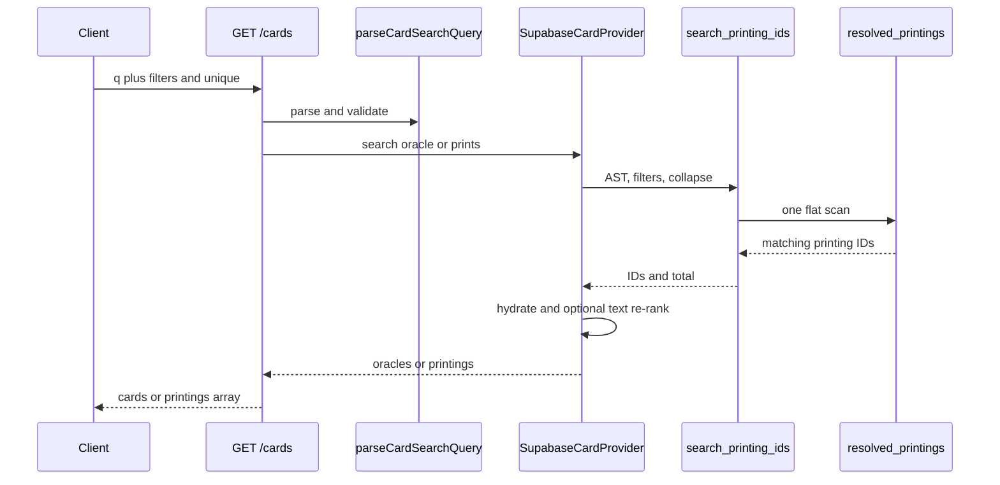

# Search

The search grammar `GET /api/v1/cards` accepts, the rules of it that are not obvious, and the one path every query takes to the database. Parameters and response shapes are in the OpenAPI spec at `/docs`; this page is what the spec cannot say.

## Result modes

The response always includes both result arrays and says which one is populated:

```json
{
  "unique": "oracle",
  "count": 1,
  "total": 1,
  "offset": 0,
  "limit": 10,
  "cards": [{ "object": "oracle", "preferred_printing": { "object": "printing" } }],
  "printings": []
}
```

- `unique=oracle` returns `object: "oracle"` rows in `cards`. Each oracle embeds the printing that matched as `preferred_printing`, so a printing-level query still displays the relevant art and edition while producing one row per card.
- `unique=prints` returns `object: "printing"` rows in `printings`. Use it when every matching physical edition matters.
- A set-only browse such as `?set=OGN` is inherently printing-shaped and returns `unique: "prints"`.
- `browse=all` returns paginated oracle rows and does not require `name` or `q`.

## Query language

The `name` (or `q`) value is parsed into an AST and combined with the explicit URL filters `type`, `artist` and `rarity` as `AND` clauses. `set` and `collector` are passed separately to the provider and the database query; they are not AST conjuncts. Input length and AST size are bounded before the query reaches Postgres.

| Construct          | Example                                              | Meaning                                                                   |
| ------------------ | ---------------------------------------------------- | ------------------------------------------------------------------------- |
| Free text          | `poro gear`                                          | Full-text name match; adjacent words combine with AND.                    |
| Type filter        | `t:champion`, `t:"champion unit"`                    | Match oracle `card_type`, `supertype`, or a tag.                          |
| Supertype filter   | `st:champion`                                        | Match oracle `supertype` only.                                            |
| Tag filter         | `tag:poro`                                           | Match oracle `tags`.                                                      |
| Artist filter      | `a:lee`, `a:"kim park"`                              | Match the printing artist.                                                |
| Rarity filter      | `r:rare`                                             | Match printing rarity.                                                    |
| Name filter        | `name:disc`                                          | Case-insensitive substring match on oracle name.                          |
| Set filter         | `set:OGN`, `s:ogn`                                   | Match printing set code.                                                  |
| Keyword filter     | `kw:deathknell`, `kw:deflect,shield`                 | Exact match against oracle `keywords`.                                    |
| Domain filter      | `d:fury`, `d:fury,order`                             | Exact match against oracle `domains`.                                     |
| Produces filter    | `produces:gem`                                       | Match token oracle names reached by a `makes_token` relationship.         |
| Numeric comparison | `might>=4`, `energy!=0`, `d>=2`                      | Compare oracle `energy`, `might`, or `power`; `d` counts domains.         |
| Legality           | `f:standard`, `banned:standard`, `notlegal:standard` | Resolve status through printing override → oracle row → legal by default. |
| Flags              | `is:token`, `is:signature`, `-is:alternate`          | Match oracle or printing properties.                                      |
| Exact name         | `!Sun`, `!"Sun Disc"`                                | Match one normalized oracle name.                                         |
| Negation           | `-t:gear`, `-(t:gear or t:spell)`                    | Exclude matches.                                                          |
| Boolean OR         | `t:gear or t:spell`                                  | Union matches; `or` is lowercase.                                         |
| Grouping           | `t:unit (a:lee or a:kim)`                            | Override implicit precedence with parentheses.                            |
| Implicit AND       | `poro t:unit`                                        | Adjacent clauses combine with AND.                                        |

Implicit AND binds tighter than `or`, so `t:a or t:b t:c` parses as `t:a OR (t:b AND t:c)`.

Field aliases: `a`/`artist`, `t`/`type`, `st`/`supertype`, `r`/`rarity`, `tag`/`tags`, `kw`/`keyword`/`keywords`, `d`/`domain`/`domains`, `s`/`set`, `produces`/`makes`, `e`/`energy`/`cost`, `m`/`might`, `p`/`power`, `f`/`format`/`legal`, `banned`, `notlegal`/`illegal`, and `is`.

Flag aliases: `sig` → `signature`, `alt`/`alternate_art` → `alternate`, and `special_collection`/`showcase` → `special`. Allowed flags are `token`, `signature`, `alternate`, `overnumbered`, `special`, `foil`, and `manual`.

Notes on less obvious rules:

- **Rarity belongs to a printing.** With the default oracle uniqueness, `r:showcase` returns one oracle with the matching showcase edition embedded as `preferred_printing`. Use `unique=prints` to return every matching showcase printing.
- **`d` is disambiguated by its operator.** `d:fury` filters domains; `d>=2` counts them.
- **Keyword and domain matching is exact**, not substring, because both are normalized vocabularies. This prevents `d:or` from matching `Order`.
- **Keyword values fold to a base key.** `kw:"Deflect 3"` and `kw:deflect` are equivalent.
- **Comma lists expand to OR** for unquoted `kw`, `d`, and `tag` values only.
- **A colon on a numeric field means equals.** `energy:2` is equivalent to `energy=2`.
- **Null stats satisfy no comparison**, including `!=`.
- **Legality is default-legal.** Only non-legal rows are stored. An unknown format matches nothing.

Unknown fields or flags, oversized inputs, malformed grouping or quotes, and invalid comparisons return HTTP 400 with `code: "BAD_QUERY"`.

## Reused by ruling rules

The same parser and SQL renderer back query-scoped rulings. An admin query is stored as an AST and re-evaluated after ingest, so a rule such as `t:unit kw:deathknell` automatically picks up later cards. A search leaf must be renderable by the database function before the parser may accept it, and an empty AST is rejected because it renders as true.

## Execution path

Every parsed search uses one path. The provider calls `search_printing_ids` with the AST, optional set/collector filters, and a collapse flag derived from `unique`. The RPC renders the AST with `card_search_ast_to_sql` and scans the trigger-maintained `resolved_printings` projection, where oracle fields and printing deltas have already been combined.

The RPC always returns printing IDs and the total. The provider hydrates those IDs, optionally re-ranks free-text results in TypeScript, then either returns the printings or attaches the matching printing to one oracle row. Search never resolves printing deltas at query time.

Parser and AST: `packages/core/src/card-search-query.ts`. The single RPC path, hydration, collapse and re-ranking: `packages/core/src/providers/supabase.ts`. URL-filter merging and uniqueness selection: `apps/api/src/routes/cards.ts`. `resolved_printings`, `card_search_ast_to_sql` and `search_printing_ids`: `supabase/migrations/20260810000000_oracle_printing_baseline.sql`.


