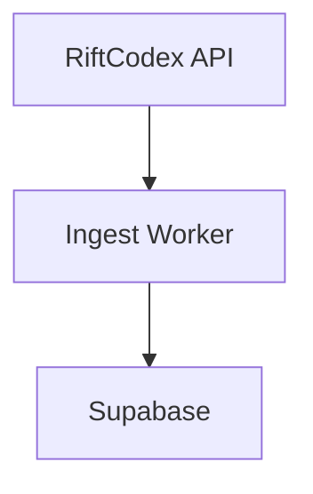

The Riftseer dev docs are built with [Docusaurus](https://docusaurus.io/) and live inside the `docs/` package at the root of the monorepo.

## Running locally

```bash
# From the repo root (preferred — avoids conflict with API on :3000):
bun run --filter docs start

# Or from within docs/ directly:
cd docs
bun run start    # dev server at http://localhost:3001
bun run build    # production build → docs/build/
bun run serve    # serve the production build
bun run clear    # clear the Docusaurus cache (use if pages fail to update)
```

## Where content lives

Most content is **co-located with its package**. Cross-cutting sections (Getting Started, Infrastructure) live under `docs/doc-pages/` so site-only markdown stays grouped apart from Docusaurus config and sidebars. The `docusaurus.config.ts` points each section at its source directory:

| Section | Source path | URL prefix |
| ------- | ----------- | ---------- |
| Getting Started | `docs/doc-pages/getting-started/` | `/getting-started/` |
| API | `packages/api/docs/` | `/api/` |
| Frontend | `packages/frontend/docs/` | `/frontend/` |
| Core | `packages/core/docs/` | `/core/` |
| Clients & Bots | `bots/docs/` | `/bots/` |
| Ingest Worker | `packages/ingest-worker/docs/` | `/` |
| Supabase | `supabase/docs/` | `/supabase/` |
| Infrastructure | `docs/doc-pages/infrastructure/` | `/infrastructure/` |

## Adding a page to an existing section

1. Create a `.md` file in the relevant source directory listed above.
2. Add frontmatter at the top:

   ```md
   ---
   title: My Page Title
   sidebar_label: Short Label
   sidebar_position: 3
   ---
   ```

3. That's it — sidebars are autogenerated. No config changes needed.

`sidebar_position` controls ordering within a section; lower numbers appear first.

## Adding a new section

When a new package or area needs its own section:

1. Create `<path>/docs/*.md` with the content (e.g. `packages/my-package/docs/index.md`).

2. Add a sidebar file in `docs/`:

   ```ts
   // docs/sidebarsMyPackage.ts
   import type {SidebarsConfig} from '@docusaurus/plugin-content-docs';

   const sidebars: SidebarsConfig = {
     myPackageSidebar: [{type: 'autogenerated', dirName: '.'}],
   };

   export default sidebars;
   ```

3. Register the plugin in `docs/docusaurus.config.ts`:

   ```ts
   ['@docusaurus/plugin-content-docs', {
     id: 'my-package',
     path: '../packages/my-package/docs',
     routeBasePath: 'my-package',
     sidebarPath: './sidebarsMyPackage.ts',
   }]
   ```

4. Add a navbar item under `themeConfig.navbar.items`:

   ```ts
   {
     type: 'doc',
     docId: 'index',
     docsPluginId: 'my-package',
     position: 'left',
     label: 'My Package',
   }
   ```

## Mermaid diagrams

Mermaid is enabled. Use a fenced code block tagged `mermaid`:

````md

````

## Deployment

The docs are deployed to GitHub Pages automatically via `.github/workflows/docs.yml` whenever changes are pushed to `main`. The workflow runs `bun run build` inside `docs/` and publishes `docs/build/` to the `gh-pages` branch.

To deploy manually:

```bash
cd docs
bun run build
bun run deploy   # requires GH_TOKEN or SSH access to the repo
```

## Key config files

| File | Purpose |
| ---- | ------- |
| `docs/docusaurus.config.ts` | Site metadata, plugins, navbar, theme |
| `docs/sidebars.ts` | Sidebar for Ingest Worker docs |
| `docs/sidebars*.ts` | One sidebar file per section |
| `docs/src/css/custom.css` | Global CSS overrides |
