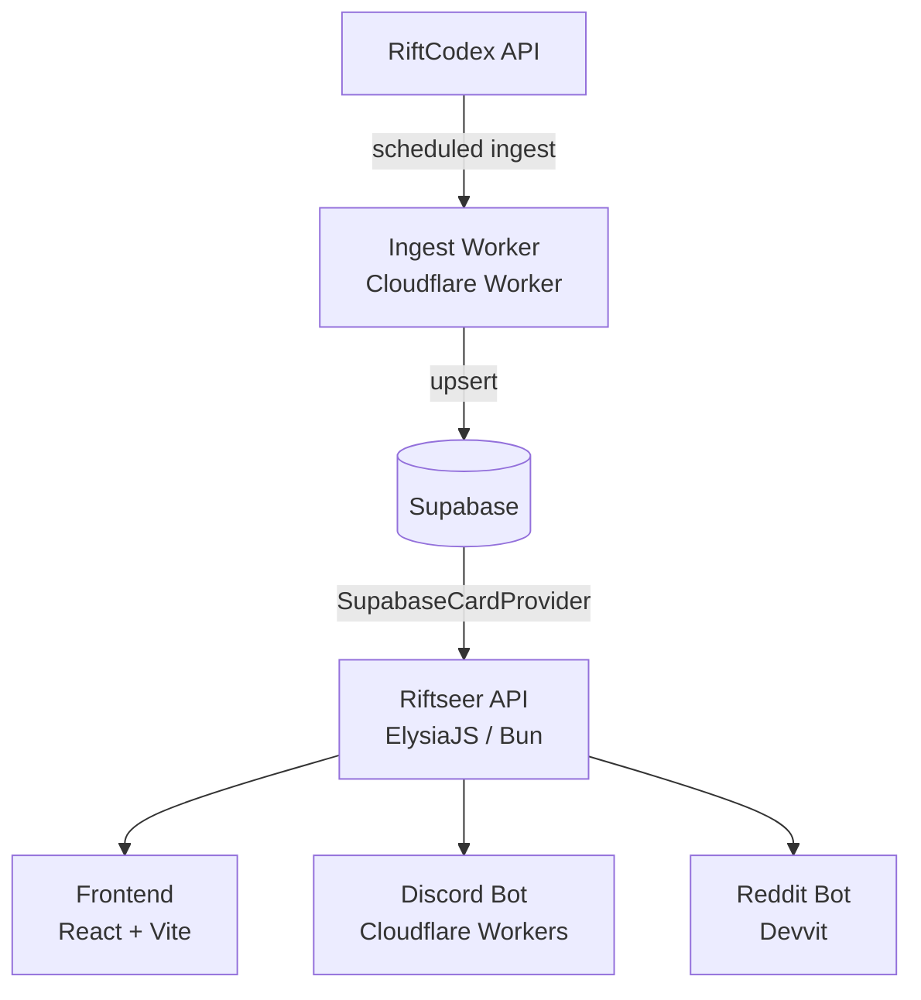

Riftseer is a Riftbound TCG card data platform. It exposes a REST API, a React frontend, and a set of bots and extensions that all share the same card data model.

## What's in the monorepo

| Package | Path | Description |
| --- | --- | --- |
| Core | `packages/core/` | Shared types, `CardDataProvider` interface, parser, Supabase provider |
| API | `packages/api/` | ElysiaJS REST API on port 3000 |
| Frontend | `packages/frontend/` | React 19 + Vite SPA |
| Ingest Worker | `packages/ingest-worker/` | Cloudflare Worker — scheduled ingest from RiftCodex into Supabase |
| Discord Bot | `packages/discord-bot/` | Slash commands on Cloudflare Workers |
| Reddit Bot | `packages/reddit-bot/` | `[[Card Name]]` mention triggers via Devvit (standalone npm project) |

---

## Prerequisites

- **[Bun](https://bun.sh) ≥ 1.2** — required. The API layer (Elysia) is Bun-first and will not work on Node.
- A **Supabase** project with the schema applied (see [Supabase docs](/supabase/)).
- Optionally: a Cloudflare account for the Discord bot and ingest worker.

---

## Running locally

### 1. Install dependencies

```bash
bun install
```

This installs all workspace dependencies in one pass. The Reddit bot (`packages/reddit-bot/`) is excluded from the workspace — `cd` into it and run `npm install` separately if needed.

### 2. Configure environment

Copy `.env.example` to `.env` and fill in the required values:

```bash
cp .env.example .env
```

The minimum required variables to run the API against Supabase:

| Variable | Purpose |
| --- | --- |
| `CARD_PROVIDER` | Set to `supabase` |
| `SUPABASE_URL` | Your Supabase project URL |
| `SUPABASE_SERVICE_ROLE_KEY` | Your Supabase service-role JWT |

See the full variable reference in the [API docs](/api/).

### 3. Start the dev server

```bash
bun dev          # API (port 3000) + frontend (Vite) together
bun dev:api      # API only — Swagger UI at http://localhost:3000/api/swagger
bun dev:frontend # Frontend only
```

---

## Running tests

```bash
bun test
```

Tests use `bun test` (Jest-compatible). API route tests use `app.handle(new Request(...))` — no live server needed.

---

## Architecture overview



- **Data flows in one direction**: RiftCodex → Ingest Worker → Supabase → API → clients.
- **The API never writes to Supabase** — all writes are done by the ingest worker.
- **Bots call the public API**, not the provider directly.

---

## Next steps

| Topic | Link |
| --- | --- |
| REST API reference | [API](/api/) |
| Card data types and provider interface | [Core](/core/) |
| Discord and Reddit bots | [Clients & Bots](/bots/) |
| Ingest pipeline | [Ingest Worker](/ingest-worker/) |
| Database schema | [Supabase](/supabase/supabase) |
| This docs site | [Docs Site](/docusaurus) |
