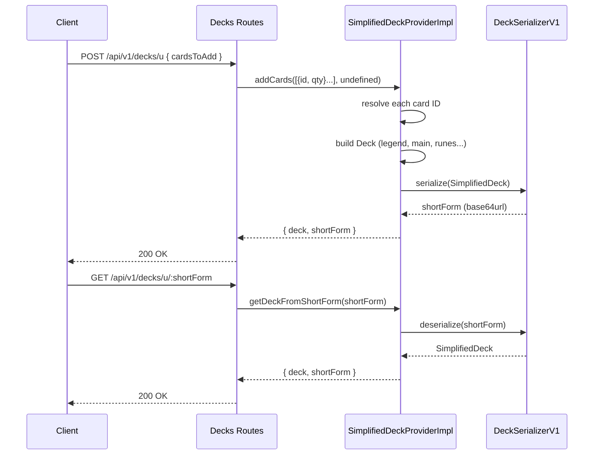

The deck endpoints allow clients to build, share, and modify decks using a compact encoded string — the **short form**. For full request/response schemas, see [API reference](https://eggsleggs.github.io/Riftseer/api-reference/#tag/decks).

---

## The short form

A short form is a base64url-encoded binary string that represents the full state of a deck. It is the primary identifier — there is no separate deck ID or database row. Decks are entirely stateless: the short form *is* the deck.

Encoding and decoding is handled by `DeckSerializerV1` in `packages/core/src/serialiser.ts`. The format uses a compact binary layout with XOR obfuscation. Clients treat it as an opaque string.

---

## Endpoints at a glance

| Method | Path | Description |
| --- | --- | --- |
| `POST` | `/api/v1/decks/u` | Create a new deck, get back a short form |
| `GET` | `/api/v1/decks/u/:shortForm` | Decode a short form to full deck data |
| `POST` | `/api/v1/decks/u/:shortForm` | Add or remove cards from an existing short form |

---

## Deck structure

A decoded deck has the following slots:

| Field | Type | Notes |
| --- | --- | --- |
| `legend` | string \| null | Card ID of the legend |
| `chosenChampionId` | string \| null | Card ID of the chosen champion |
| `mainDeck` | string[] | `id:qty` entries, max 40 cards |
| `sideboard` | string[] | `id:qty` entries |
| `runes` | string[] | `id:qty` entries |
| `battlegrounds` | string[] | Card IDs (no quantity) |

Card entries in `mainDeck`, `sideboard`, and `runes` use the format `<uuid>:<quantity>`, e.g. `123e4567-e89b-12d3-a456-426614174000:2`.

---

## POST /api/v1/decks/u — Create

Create a new deck from a list of card IDs and quantities.

```json
POST /api/v1/decks/u
{
  "cardsToAdd": [
    "123e4567-e89b-12d3-a456-426614174000:1",
    "987fbc97-4bed-5078-9f07-9141ba07c9f3:3"
  ]
}
```

The API resolves each ID, determines the card's role (legend, rune, battleground, main deck) from its `classification`, and builds the deck accordingly. Returns the full deck object and the short form string.

`cardsToRemove` is not valid on a new deck — it will return 400.

---

## GET /api/v1/decks/u/:shortForm — Decode

Decode a short form string back into a full deck object.

```http
GET /api/v1/decks/u/abc123XYZ...
```

Returns the same `{ deck, shortForm }` shape. Returns 404 if the short form is structurally valid but references unknown cards, and 400 if the string is malformed.

---

## POST /api/v1/decks/u/:shortForm — Update

Add or remove cards from an existing deck. Pass the current short form as the path param and the changes in the body.

```json
POST /api/v1/decks/u/abc123XYZ...
{
  "cardsToAdd": ["new-card-uuid:2"],
  "cardsToRemove": ["old-card-uuid:1"]
}
```

At least one of `cardsToAdd` or `cardsToRemove` must be present. Returns the updated deck and a new short form — the original short form is unchanged.

---

## Flow diagram


