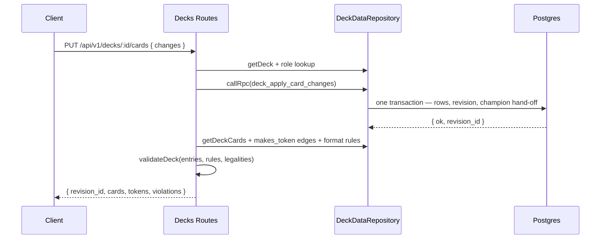

Decks are stored rows, not encoded strings. A deck has an owner, a format, a
visibility, zones of cards, a collaborator roster and a revision history. The
plain-text interchange format replaces the old short form: it can be pasted into
a forum post, diffed, and typed by hand.

For full request/response schemas, see
[API reference](https://eggsleggs.github.io/Riftseer/api-reference/#tag/decks).

---

## Model

Counting is by **oracle**, display is by **printing**. A `deck_cards` row names
both: the printing supplies art and the printing rung of legality, while every
construction rule (copy limits, domain matching, zone eligibility) reads oracle
fields. Three copies of one card split across two arts are three copies against
the limit and two rows in the list.

| Zone | Notes |
| --- | --- |
| `legend` | Exactly one card |
| `main` | The deck proper |
| `sideboard` | |
| `runes` | |
| `battlefields` | |
| `considering` | Ours, not a game zone; counts toward nothing |

The chosen champion is a **flag on a `main` row**, not a zone: you may run three
copies and nominate one of them.

Tokens are **derived**, never stored membership. A deck's tokens are whatever
its oracles' `makes_token` relationships point at, so a client cannot add or
remove one. `deck_token_printings` only records which art the deck shows for a
token it already makes.

Validation is advisory and computed on read, by the shared `validateDeck` in
`@riftseer/types/deck-validate`: a deck saved under one set of format rules must
stay loadable after those rules change. `GET /decks/:id` returns the violations
alongside the cards.

---

## Visibility and roles

Visibility and role are orthogonal.

| Visibility | Who can read |
| --- | --- |
| `public` | Anyone, and it appears in the owner's public list |
| `unlisted` | Anyone holding the id — never listed for another user |
| `private` | The owner and collaborators |

| Role | Capability |
| --- | --- |
| owner | Everything, and the only role that may delete the deck, manage collaborators, or change `visibility` |
| editor | Card mutations and metadata patches, but not `visibility` — being invited to help build is not consent to be published |
| viewer | Read only |

The Worker holds a service-role key and bypasses RLS, so the route code in
`src/routes/decks.ts` is the real authorisation boundary; the database policies
are defence in depth against a leaked anon key.

A deck the caller may not read returns **404, not 403** — a 403 would confirm the
deck exists.

---

## Endpoints at a glance

| Method | Path | Description |
| --- | --- | --- |
| `GET` | `/api/v1/decks` | Your decks, or a user's by `?handle` |
| `POST` | `/api/v1/decks` | Create a deck |
| `GET` | `/api/v1/decks/:id` | Cards, derived tokens and violations |
| `PATCH` | `/api/v1/decks/:id` | Name, description, primer, format, visibility |
| `DELETE` | `/api/v1/decks/:id` | Owner only |
| `PUT` | `/api/v1/decks/:id/cards` | Batch zone mutation |
| `GET` | `/api/v1/decks/:id/revisions` | Edit history |
| `POST` | `/api/v1/decks/:id/invite` | Create or regenerate the invite link |
| `DELETE` | `/api/v1/decks/:id/invite` | Disable the invite link |
| `POST` | `/api/v1/decks/join/:code` | Redeem an invite link |
| `POST` | `/api/v1/decks/:id/collaborators` | Invite by handle (owner only) |
| `DELETE` | `/api/v1/decks/:id/collaborators?handle=` | Remove (owner only) |
| `POST` | `/api/v1/decks/import` | Import Moxfield-style text |
| `GET` | `/api/v1/decks/:id/export` | Export Moxfield-style text |

Reads take optional auth — who is asking changes the answer, but anonymous is
allowed. Every write requires a bearer token.

---

## PUT /api/v1/decks/:id/cards

One call carries a whole batch, because the builder edits in bursts and the
history should record intent rather than keystrokes.

```json
PUT /api/v1/decks/<id>/cards
{
  "changes": [
    { "zone": "legend", "printing_id": "67f4…dd7", "oracle_id": "…", "quantity": 1 },
    { "zone": "main", "printing_id": "67f4…abc", "oracle_id": "…", "quantity": 3, "is_champion": true },
    { "zone": "main", "printing_id": "67f4…def", "quantity": 0 }
  ]
}
```

`quantity: 0` removes the row, and a removal need not restate `oracle_id`. The
whole batch is applied by the `deck_apply_card_changes` RPC in one transaction:
revision creation, the five-minute coalescing window and the champion hand-off
all have to be atomic.

The response is the re-read view — `revision_id`, `cards`, `tokens`,
`violations` — so the builder never has to guess at the new state.
`revision_id` is `null` when a burst nets to no change at all.

---

## Invite links

`POST /decks/:id/invite` generates a fresh code and sets the role it grants.
Redeeming through `POST /decks/join/:code` inserts a `deck_collaborators` row
with `added_via: "link"`, which is what makes the two operations independent:
regenerating or disabling the link never kicks anyone already in, and any
individual collaborator stays revocable.

---

## Text interchange

Moxfield-style: zone headers, then `<qty> <name>` lines with an optional
`(SET) COLLECTOR` suffix pinning one printing and a trailing `*CH*` marking the
chosen champion.

```text
Legend
1 Test Legend (OGN) 001

Main
3 Test Unit (OGN) 002 *CH*

Runes
12 Test Rune (OGN) 003
```

Parsing never throws. `POST /decks/import` resolves each name (and optional set
and collector number) against the catalogue — that resolution is the API's job,
since only it can see the catalogue — and reports the lines it could not read in
`unresolved` rather than failing the import. A line whose card cannot sit in the
zone its header named is routed to the zone it is eligible for, which is what
makes a bare list with no headers import correctly.

---

## Flow diagram


```mermaid
sequenceDiagram
    participant Client
    participant API as Decks Routes
    participant Repo as DeckDataRepository
    participant DB as Postgres

    Client->>API: PUT /api/v1/decks/:id/cards { changes }
    API->>Repo: getDeck + role lookup
    API->>Repo: callRpc(deck_apply_card_changes)
    Repo->>DB: one transaction — rows, revision, champion hand-off
    DB-->>Repo: { ok, revision_id }
    API->>Repo: getDeckCards + makes_token edges + format rules
    API->>API: validateDeck(entries, rules, legalities)
    API-->>Client: { revision_id, cards, tokens, violations }
```
