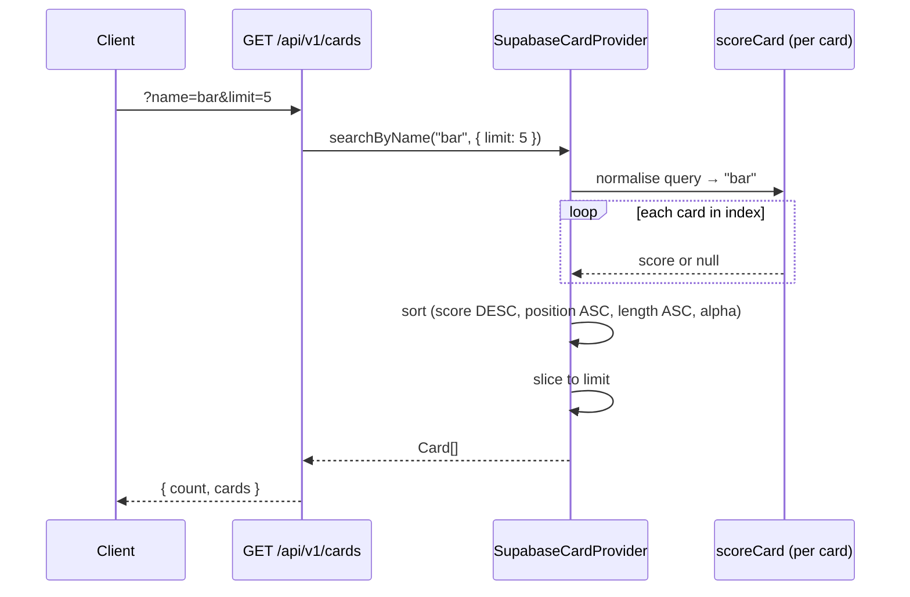

`GET /api/v1/cards` is part of the [Cards](./cards.md) group of endpoints. This page is a deep-dive into how search actually works — the scoring model, name normalisation pipeline, and the distinction between autocomplete mode and exact lookup.

---

## Two modes

| Mode | Endpoint | Use case |
|---|---|---|
| **Autocomplete** | `GET /api/v1/cards?name=<q>` | Live search bar, partial queries |
| **Exact lookup** | `POST /api/v1/cards/resolve` | Bot triggers (`[[Card Name]]`), deterministic resolution |

---

## Autocomplete mode

Default behaviour of `GET /api/v1/cards`. No extra params required.

Implemented in `packages/core/src/search.ts` (`autocompleteSearch`, `scoreCard`) and called from `SupabaseCardProvider.searchByName` when `opts.fuzzy !== false`.

### Scoring tiers

Every card in the index is scored against the normalised query. Results below the minimum score threshold (100) are excluded entirely. The remainder are sorted and sliced to the requested `limit`.

| Score | Tier |
|---|---|
| 1000 | **Exact**: normalised name matches query exactly |
| 900 | **Full-name prefix**: name starts with the full query |
| 800 − (10 × word position) | **Word-prefix**: a word in the name starts with the query — earlier words rank higher |
| 700 − (2 × match offset) | **Substring**: query appears anywhere in the name — earlier offset ranks higher |
| 200 − (50 × edit distance) | **Fuzzy**: Levenshtein match on the full name or an individual word |
| 0 | No match — excluded |

**Example — query `bar`:**

| Card | Tier | Score |
|---|---|---|
| Bard | Full-name prefix (`bard` starts with `bar`) | 900 |
| Barrow Stinger | Full-name prefix (`barrow stinger` starts with `bar`) | 900 → tiebreak: shorter name wins |
| Cannon Barrage | Word-prefix (`barrage` is word 2, starts with `bar`) | 790 |
| Singularity | No match | excluded |

### Minimum query length per tier

| Query length | Tiers active |
|---|---|
| 1 char | Exact, full-name prefix only |
| 2 chars | + word-prefix |
| 3 chars | + substring |
| 4+ chars | + fuzzy (max 1 edit for length 4–5, max 2 edits for length 6+) |

Short queries never trigger broad fuzzy guesses. A single character like `b` will not match `Cannon Barrage` via word-prefix — that requires at least 2 characters.

### Tiebreak order

When two cards have the same score:

1. Earlier match position wins (offset 0 beats offset 3)
2. Shorter name wins (`Bard` beats `Barrow Stinger` at the same score)
3. Alphabetical as a final stable tiebreak

### Fuzzy matching

Fuzzy matching uses Levenshtein edit distance computed in `packages/core/src/search.ts`. The distance is checked against each word in the card name individually, not the full name as a single string. A Fuse.js instance may optionally be merged for additional fuzzy coverage, but the deterministic scorer runs first — Fuse hits only fill in cards the scorer missed.

### Opting out of autocomplete

Pass `?fuzzy=false` (or `?fuzzy=0`) to get exact-only behaviour:

```
GET /api/v1/cards?name=Sun+Disc&fuzzy=false
```

Returns only cards whose normalised name exactly matches the normalised query. Returns an empty array (not 404) if nothing matches.

---

## Exact lookup mode

`POST /api/v1/cards/resolve` — used by the Discord bot and Reddit bot for `[[Card Name]]` triggers.

Implemented in `SupabaseCardProvider.resolveRequest`. Resolution order:

1. Normalise the requested name → look up in the `byNorm` map (exact normalised match)
2. If the request includes a set code + collector number, filter to that printing
3. If the request includes a set code only, filter to that set
4. If nothing matches, fall back to a single Fuse.js search → `matchType: "fuzzy"`
5. If still nothing → `{ card: null, matchType: "not-found" }`

Callers should treat `not-found` as a 404-equivalent — no card was found and no fuzzy guess was made.

---

## Name normalisation

All comparisons pass through `normalizeCardName` (`packages/core/src/normalize.ts`):

```
lowercase
→ strip apostrophes, right-single-quotes, hyphens
→ strip remaining non-word / non-space characters
→ collapse repeated spaces
→ trim
```

Example: `"Bard's Harp"` → `"bards harp"`.

The normalised form is stored on each card as `name_normalized` and is the key used in the `byNorm` index. Both the query and the index key are normalised before comparison, making punctuation and case differences invisible to search.

---

## Flow diagram



---

## Key files

| File | Role |
|---|---|
| `packages/core/src/search.ts` | Scoring logic — `autocompleteSearch`, `scoreCard`, Levenshtein |
| `packages/core/src/normalize.ts` | `normalizeCardName` — shared by index build and query path |
| `packages/core/src/providers/supabase.ts` | `searchByName` (autocomplete), `resolveRequest` (exact lookup) |
| `packages/api/src/routes/cards.ts` | `GET /cards` route — wires `fuzzy` param to mode selection |
| `packages/core/src/__tests__/search.test.ts` | Unit tests for scoring and ranking |
