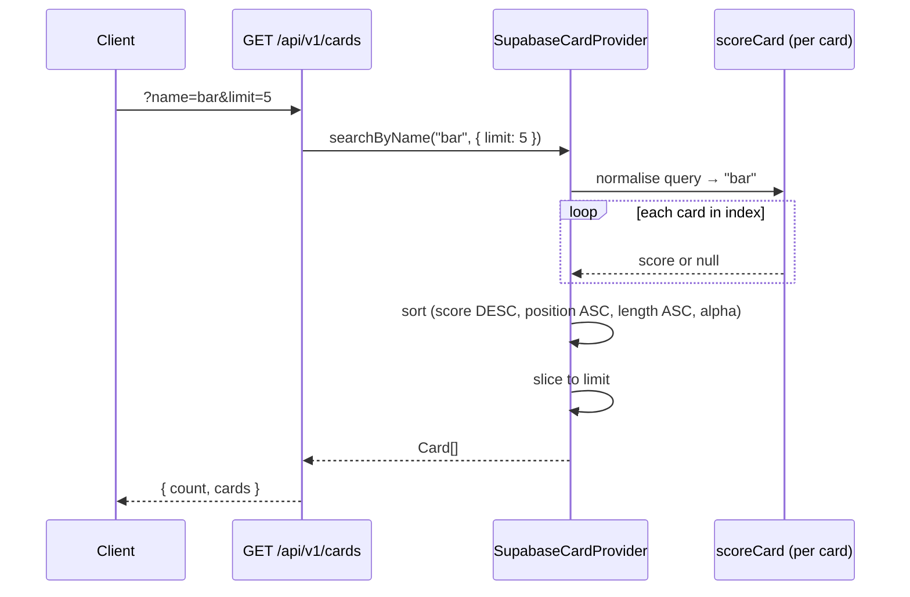

`GET /api/v1/cards` is part of the [Cards](./cards.md) group of endpoints. This page covers how to use the search endpoint and when each mode applies. The scoring model, name normalisation, and Levenshtein implementation live in `packages/core/src/search.ts` — see the Core docs for those details.

---

## Two modes

| Mode | Trigger | Use case |
| --- | --- | --- |
| **Autocomplete** | `GET /api/v1/cards?name=<q>` | Live search bar, partial queries |
| **Exact lookup** | `POST /api/v1/cards/resolve` | Bot triggers (`[[Card Name]]`), deterministic resolution |

---

## Autocomplete mode

Default behaviour of `GET /api/v1/cards`. No extra params needed.

The route calls `provider.searchByName(name, opts)`, which delegates to `autocompleteSearch` in `packages/core/src/search.ts`. Every card in the index is scored against the normalised query and results below the minimum threshold are dropped. The scoring model uses exact, prefix, word-prefix, substring, and fuzzy tiers — see `packages/core/src/search.ts` for the full scoring breakdown.

### Opting out of autocomplete

Pass `?fuzzy=false` (or `?fuzzy=0`) to require an exact normalised name match:

```http
GET /api/v1/cards?name=Sun+Disc&fuzzy=false
```

Returns only cards whose normalised name exactly matches the normalised query. Returns an empty array (not 404) if nothing matches. Any other value for `fuzzy` (including omitting it entirely) keeps the default autocomplete behaviour.

---

## Exact lookup mode

`POST /api/v1/cards/resolve` — used by the Discord and Reddit bots for `[[Card Name]]` triggers.

Implemented in `SupabaseCardProvider.resolveRequest`. Resolution order:

1. Normalise the name → look up in the `byNorm` map
2. If the request includes a set code + collector number, filter to that printing
3. If the request includes a set code only, filter to that set
4. If nothing matches, fall back to a single Fuse.js search → `matchType: "fuzzy"`
5. If still nothing → `{ card: null, matchType: "not-found" }`

`not-found` means no card was found and no fuzzy guess was made.

---

## Flow diagram



---

## Key files

| File | Role |
| --- | --- |
| `packages/core/src/search.ts` | Scoring logic — `autocompleteSearch`, `scoreCard`, Levenshtein |
| `packages/core/src/normalize.ts` | `normalizeCardName` — shared by index build and query path |
| `packages/core/src/providers/supabase.ts` | `searchByName` (autocomplete), `resolveRequest` (exact lookup) |
| `packages/api/src/routes/cards.ts` | `GET /cards` route — wires `fuzzy` param to mode selection |
| `packages/core/src/__tests__/search.test.ts` | Unit tests for scoring and ranking |
