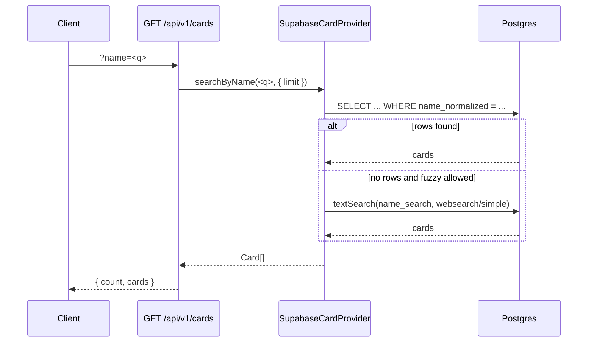

`GET /api/v1/cards` is part of the [Cards](./cards.md) group of endpoints. This page covers query parameters and how search behaves with the Supabase provider.

---

## Two modes

| Mode | Trigger | Use case |
| --- | --- | --- |
| **Default (FTS fallback)** | `GET /api/v1/cards?name=<q>` | Live search bar; exact `name_normalized` match first, then Postgres `tsvector` on `name_search` |
| **Exact name only** | `GET /api/v1/cards?name=<q>&fuzzy=false` (or `fuzzy=0`) | Strict catalogue lookup — no full-text fallback |
| **Batch resolve** | `POST /api/v1/cards/resolve` | Bots (`[[Card Name]]`), deterministic resolution per request |

---

## Default search (`fuzzy` omitted or true)

The route calls `provider.searchByName(name, opts)`.

`SupabaseCardProvider` implementation:

1. **`normalizeCardName(query)`** — same normalization as stored `name_normalized`.
2. **Exact path** — `WHERE name_normalized = <normalized query>` (optional `set` / `collector` filters).
3. If no rows and fuzzy is allowed — **`textSearch('name_search', …)`** with `websearch` type and `simple` config (Postgres `tsvector` on `name` + `name_normalized`).

There is no in-memory card index. Ranking follows Postgres FTS relevance for the fallback step.

### Opting out of FTS fallback

Pass `?fuzzy=false` or `?fuzzy=0` to require an exact normalized name match only:

```http
GET /api/v1/cards?name=<normalised-or-display-name>&fuzzy=false
```

Returns only cards whose normalized name exactly matches the normalized query. Returns an empty array (not 404) if nothing matches. Omitting `fuzzy` or using other values keeps the default (exact first, then FTS).

With the default mode, the FTS step matches **whole lexemes** from the `simple` config (see Postgres `tsvector` behaviour). Very short or typo queries may return no rows if no token matches.

---

## Batch resolve

`POST /api/v1/cards/resolve` — used by the Discord and Reddit bots for `[[Card Name]]` triggers.

Implemented in `SupabaseCardProvider.resolveRequest`. Resolution order:

1. Load candidates with **`name_normalized`** equal to the normalised request name.
2. Prefer set + collector, then set, then first candidate (same as before).
3. If none — **one row** from **`textSearch` on `name_search`** → `matchType: "fuzzy"`.
4. If still nothing → `{ card: null, matchType: "not-found" }`.

Request body: `{ "requests": string[], "include"?: string }` (max 20 strings — plain names or `[[Name|SET]]` tokens as documented on [Cards](./cards.md)). Pass `"include": "prices"` to include price data on resolved cards.

---

## Flow (high level)



---

## Key files

| File | Role |
| --- | --- |
| `packages/core/src/normalize.ts` | `normalizeCardName` — exact match path |
| `packages/core/src/providers/supabase.ts` | `searchByName`, `resolveRequest` — exact query + `textSearch` |
| `packages/core/src/search.ts` | `autocompleteSearch` / `scoreCard` for in-process re-ranking of FTS candidates |
| `packages/api/src/routes/cards.ts` | `GET /cards` — passes `fuzzy` query param to provider |
| `supabase/migrations/*name_search*` | `name_search` `tsvector` + GIN index |
