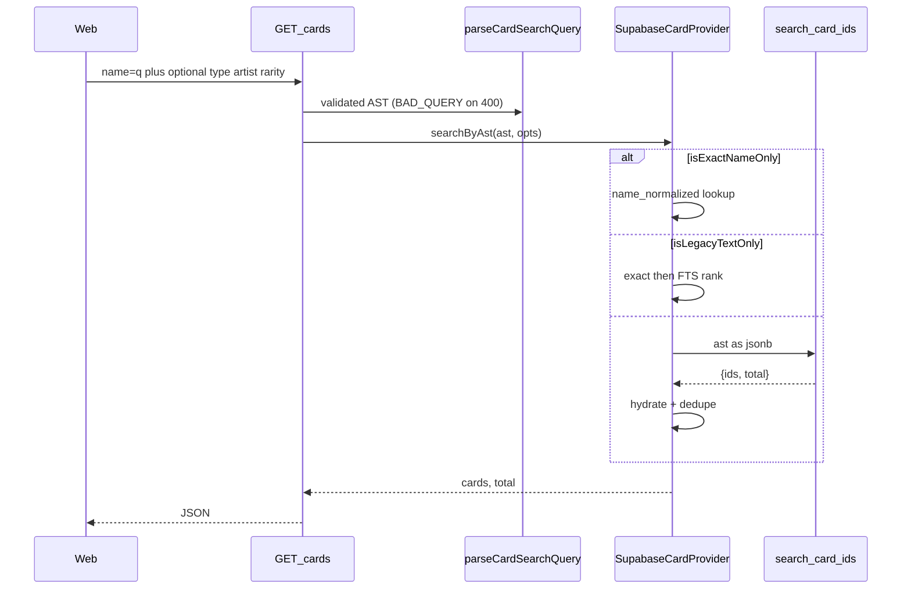

`GET /api/v1/cards` is part of the [Cards](./cards.md) group of endpoints. This page covers query parameters, the search query language, and how the Supabase provider routes between fast and structured execution paths.

---

## Query parameters

| Param | Description |
| --- | --- |
| `name` | Search query. Structured keyword language with `t:` / `a:` / `r:` filters (see below). |
| `q` | Alias for `name`. When both are present, `name` wins. |
| `type` | Optional explicit type filter. Merged with the parsed query as `AND t:value`. |
| `artist` | Optional explicit artist filter (`AND a:value`). |
| `rarity` | Optional explicit rarity filter (`AND r:value`). |
| `set` | Set code filter, e.g. `OGN`. |
| `collector` | Collector number filter. |
| `fuzzy` | Pass `false` or `0` to disable fuzzy/autocomplete matching. |
| `limit` | Max results per page (default 10, max 100). |
| `offset` | 0-based offset into the ranked result set. |
| `include` | Extra fields to include, e.g. `prices`. |

---

## Query language

The `name` (or `q`) parameter is parsed into an AST and combined with any explicit URL filters. The grammar is intentionally small, with hard limits on input length and AST size to keep parsing and SQL bounded.

| Construct | Example | Meaning |
| --- | --- | --- |
| Free text | `poro gear` | Full-text name match (multiple words combine). |
| Type filter | `t:champion`, `t:"champion unit"` | Match `classification.type`, `supertype`, or any tag. |
| Artist filter | `a:lee`, `a:"kim park"` | Match the joined artist name. |
| Rarity filter | `r:rare` | Match `classification.rarity`. |
| Exact name | `!Sun`, `!"Sun Disc"` | Match a single normalized card name. |
| Negation | `-t:gear`, `-(t:gear or t:spell)` | Exclude matching cards. |
| Boolean OR | `t:gear or t:spell` | Union of matches (lowercase `or` keyword). |
| Grouping | `t:unit (a:lee or a:kim)` | Use parentheses to override implicit precedence. |
| Implicit AND | `poro t:unit` | Adjacent clauses combine with AND. |

Implicit AND binds tighter than `or`. So `t:a or t:b t:c` parses as `t:a OR (t:b AND t:c)` — use parentheses when in doubt. Field aliases: `a` / `artist`, `t` / `type`, `r` / `rarity`.

Unknown fields, oversized inputs, unbalanced parentheses, or unterminated quoted strings produce a **400** with `code: "BAD_QUERY"`.

---

## Execution paths

`SupabaseCardProvider.searchByAst` routes by AST shape:

| Path | When | Implementation |
| --- | --- | --- |
| **ExactNameOnly** | AST is a single `!exact-name` leaf | `name_normalized = ?` lookup, optional set/collector |
| **LegacyTextOnly** | AST is a single free-text leaf (no filters) | Existing exact-then-FTS path with TS-side autocomplete ranking |
| **RPC** | Anything else (filters, OR, NOT, grouping, text+filters) | `search_card_ids` RPC over the AST; results hydrated and deduped in TS |

The RPC (`supabase/migrations/*_add_card_search_rpc.sql`) walks the AST in PL/pgSQL with strict whitelisting of fields, escapes ILIKE patterns, and parameterizes every user value via `quote_literal`. It returns up to `p_max_ids` matching ids plus the unfiltered total — the TS layer hydrates, dedupes variant printings, and slices for pagination.


```mermaid
sequenceDiagram
  participant Web
  participant API as GET_cards
  participant Parse as parseCardSearchQuery
  participant Prov as SupabaseCardProvider
  participant RPC as search_card_ids

  Web->>API: name=q plus optional type artist rarity
  API->>Parse: validated AST (BAD_QUERY on 400)
  API->>Prov: searchByAst(ast, opts)
  alt isExactNameOnly
    Prov->>Prov: name_normalized lookup
  else isLegacyTextOnly
    Prov->>Prov: exact then FTS rank
  else
    Prov->>RPC: ast as jsonb
    RPC-->>Prov: {ids, total}
    Prov->>Prov: hydrate + dedupe
  end
  Prov-->>API: cards, total
  API-->>Web: JSON
```

---

## Examples

```http
GET /api/v1/cards?name=poro%20t%3Aunit
GET /api/v1/cards?name=t%3Agear%20or%20t%3Aspell
GET /api/v1/cards?name=t%3Aunit%20(a%3Alee%20or%20a%3Akim)
GET /api/v1/cards?name=%21%22Sun%20Disc%22
GET /api/v1/cards?name=Sun%20-t%3Agear
GET /api/v1/cards?type=Gear&rarity=Uncommon
```

---

## Batch resolve

`POST /api/v1/cards/resolve` is unchanged — used by the Discord and Reddit bots for `[[Card Name]]` triggers. See `SupabaseCardProvider.resolveRequest`.

---

## Key files

| File | Role |
| --- | --- |
| `packages/core/src/card-search-query.ts` | Tokenizer / parser / AST / validation / routing predicates |
| `packages/core/src/normalize.ts` | `normalizeCardName` — exact-match path |
| `packages/core/src/providers/supabase.ts` | `searchByAst`, three-path routing, RPC hydration |
| `packages/api/src/routes/cards.ts` | `GET /cards` — parses `name` / `q`, merges structured params, validates AST |
| `supabase/migrations/*name_search*` | `name_search` `tsvector` + GIN index |
| `supabase/migrations/*add_card_search_rpc*` | `search_card_ids` RPC + `card_search_ast_to_sql` helper |
