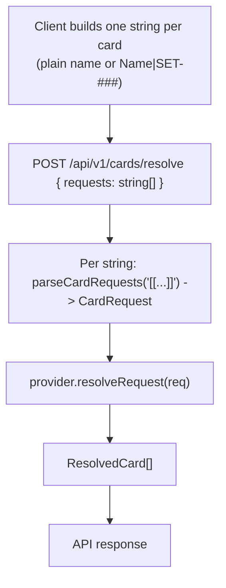

`src/parser.ts` re-exports `parseCardRequests()` from [`@riftseer/types`](../types/parser). For the full function reference, token syntax table, and examples see the [`@riftseer/types` Parser page](../types/parser).

---

## Importing

```typescript
// From core (re-exports from @riftseer/types)
import { parseCardRequests } from "@riftseer/core";

// Directly from types
import { parseCardRequests } from "@riftseer/types";
```

---

## Usage in the resolve flow

`POST /api/v1/cards/resolve` accepts JSON `{ requests: string[] }` (up to 20 strings). For each string the API wraps it as `[[…]]` and runs `parseCardRequests` once, then resolves the resulting `CardRequest` via `provider.resolveRequest()`. Clients — like the Discord bot — typically build one string per card (composing `name` and optional `set` into a single token) rather than passing a full message body through `parseCardRequests` in one shot.



See [Provider Interface](./provider.md) for `resolveRequest` and [Types](./types.md) for `CardRequest` / `ResolvedCard`.
