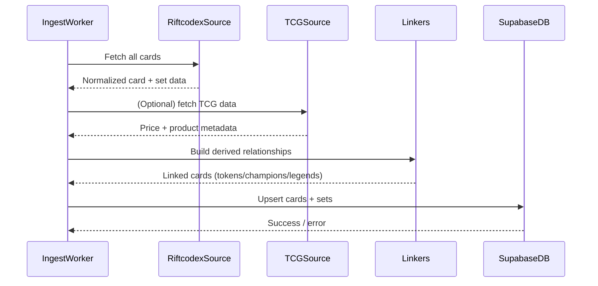

The ingest pipeline is responsible for turning raw data from RiftCodex (and related sources) into the normalized card and set records stored in Supabase.

This page gives a high-level view of the steps involved and where to look in the codebase for more detail.

## High-level flow

The main pipeline entry point is `packages/ingest-worker/src/ingest.ts`. At a high level, it:

In code terms, the pipeline:

1. Fetches card data from RiftCodex via `src/sources/riftcodex.ts`
2. Fetches and applies TCG-related data via `src/sources/tcgplayer.ts` (if enabled)
3. Runs linkers in `src/pipeline/linkers.ts` to connect tokens, champions, legends, and other derived relationships
4. Persists everything into Supabase using helpers in `src/pipeline/db.ts`

The ingest worker is designed to be **idempotent**: running it multiple times with the same upstream data should converge to the same state in Supabase.

## Sources

- `src/sources/riftcodex.ts` – fetches pages from the public RiftCodex API and normalizes them into internal card/set structures.
- `src/sources/tcgplayer.ts` – optional enrichment of cards with TCGPlayer pricing and product metadata.

## Linkers

The linkers are responsible for deriving relationships that are not explicitly present in the raw data but are useful for the API and frontend.

They live in:

- `src/pipeline/linkers.ts`

Examples of tasks the linkers may perform:

- Connect token cards to the main card that creates them
- Link champions/legends to their associated cards or decks
- Normalize or merge cards that represent multiple printings

## Database writes

The final step of the pipeline writes data into Supabase.

This logic lives in:

- `src/pipeline/db.ts`

Responsibilities typically include:

- Upserting sets and cards into Supabase tables
- Handling soft-deleted or rotated cards appropriately
- Ensuring referential integrity between sets, cards, and any auxiliary tables

See the Supabase migrations in the root `supabase/migrations/` folder for the exact schema the pipeline targets.

For details on pointing the ingest worker at either a live Supabase project or a local Supabase stack, see the Supabase docs under `supabase/docs/supabase.md` in the repo.
